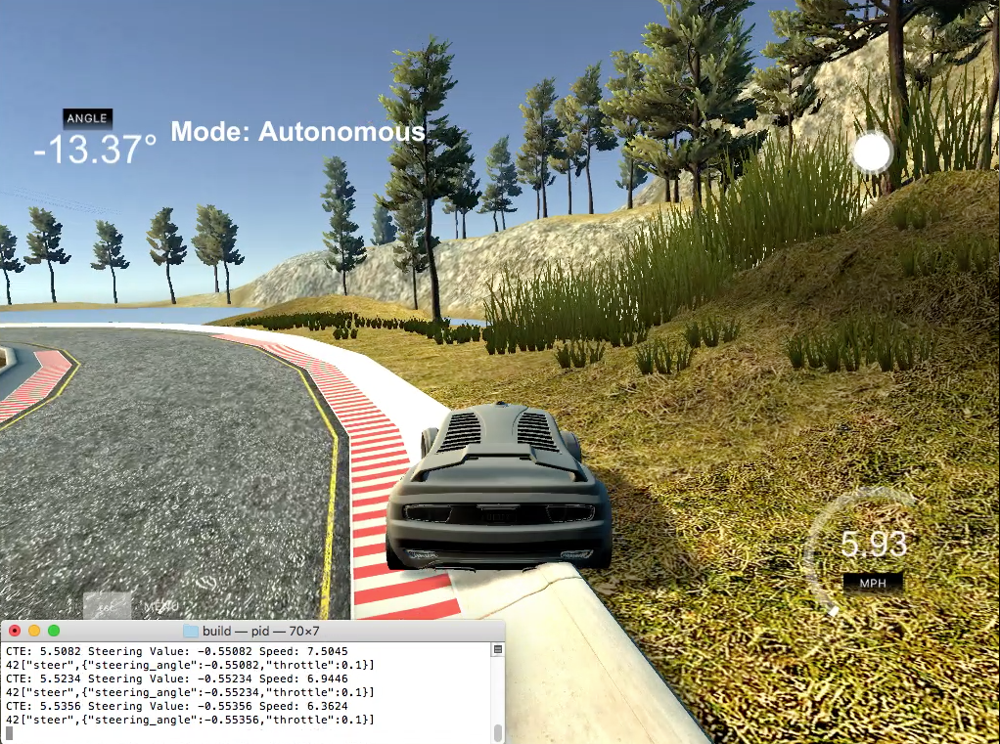
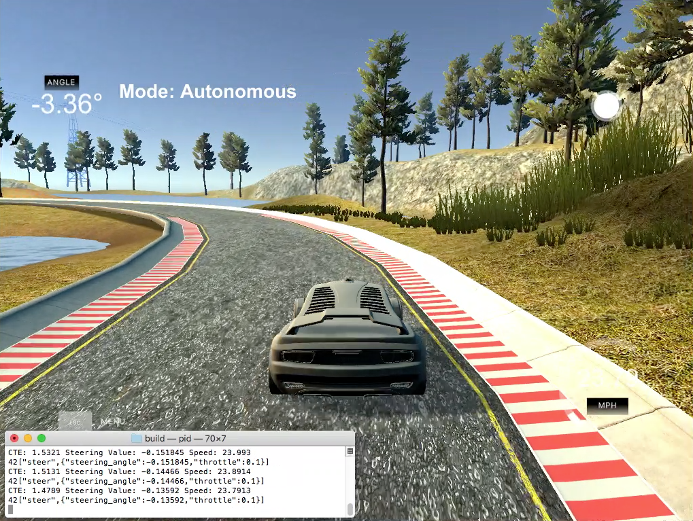
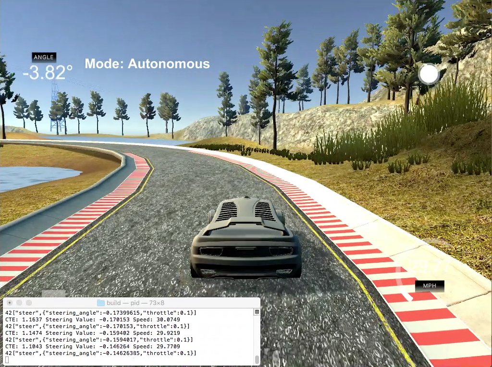

# PID Control Project

####Udacity's Self-Driving Car Engineer Nanodegree Program

------

##Overview

The idea behind this project is to implement a PID controller as described in the lectures and to use it to control the steering of a simulated vehicle in order to allow it to successully drive a windy track.  This is achieved by tuning the controller's hyperparameters based upon using the vehicle's cross-track error (CTE) as an input.  We separately track the CTE, its derivative and its integral and use all three in determing a control output in order to minimize the collective error.

Additionally, I implemented a PID controller to control the vehicles speed via throttle control because I noticed that the vehicle's ability to follow the centerline of the road tended to be a strong function of the vehicle's speed.  This controller noticeably improved the performance of the vehicle by allowing it to speed up on the easy parts of the track and slow down on the tricky parts.   


##Results

In tuning the PID controller, I staarted with the steering controller while keeping the throttle setting fixed to 30%.  I discovered that the first order of business was setting tuning the P control while setting both I and D to zero initially.  

Increasing the P-constant cause the vehicle to oscilate its position about the centerline of the road.  I picked a value that cause the vehicle to be responsive - so much so that the vehicle ran of the track at some point to a dynamic instability caused by the wild steering oscillations about the centerline.



Next, I tuned the D-constant as a quick test showed me the this had a great effect on damping out the oscillations.  With a little manual tuning, I was very quickly able to get the vehicle to drive well around the track. 




At this point, I increased the I-constant very slightly because I found that this made the vehicle sit slightly closer to the centerline of the road.  This is really just a slight effect, but tends to be more noticeable after long, straight portions of the road.  Setting too high an I-constant caused the car to oscillate wildly.




I have included in the repository video of the tuning processing using P-only control, then PD control and then the final PID controller.  These are available for download in the `VideoClips` directory.

The car was driving well at this point, however, at some sections of the track, on the sharp bends, it was getting a little too close to the edge of the road.  Consueqently, I decided to add a PID controller for the throttle control.  This worked exactly the same way as the steering control EXCEPT FOR the fact that we used the absolute value of the CTE in the case of throttle control.  This is due to the fact that the throttle should be reduced regardless of whether the CTE is positive or negative.  There is a symmetry that applies to throttle control that does not apply to steering control which is directional.  This is show in the following differences in the implementation of each controller (lines 65-66 and 68-69 in `main.cpp`).	

```C++
	s_pid.UpdateError(cte);
	double steer_value = -s_pid.TotalError();  
```
```C++
	t_pid.UpdateError(fabs(cte));
	double throttle_value = 0.3 - t_pid.TotalError();
```
The reference throttle setting was set at 30%, but it was found that with a little more aggressive tuning could handle throttle settings of 50% although the car drove wildly!  Possibly using something like Twiddle to fine tuned the PID parameters would have helped a little, but I found that everything worked pretty well.  

The constant for the throttle controller were tuning very quickly manually in a similar fashion to what was done for the steering controller.  FIrst a fairly aggressive P-value was found.  This immediately had a pronounced effect by reducing the speed aggressively on the sharp cornered sections of the track and aggressively speeding up on the straight portions.  This was tempered by adding a little D-control.  It was found that no I-control was needed for the throttle so this was left at 0.

Good final values for the PID constants for the steering and throttle controllers were found to be:

​		**Steering PID Constants:	[0.1, 0.0005, 0.35]**  

​		**Throttle PID Constants:	[0.25, 0.0, 0.005]** 

------


##Appendix

## Dependencies

* cmake >= 3.5
 * All OSes: [click here for installation instructions](https://cmake.org/install/)
* make >= 4.1(mac, linux), 3.81(Windows)
  * Linux: make is installed by default on most Linux distros
  * Mac: [install Xcode command line tools to get make](https://developer.apple.com/xcode/features/)
  * Windows: [Click here for installation instructions](http://gnuwin32.sourceforge.net/packages/make.htm)
* gcc/g++ >= 5.4
  * Linux: gcc / g++ is installed by default on most Linux distros
  * Mac: same deal as make - [install Xcode command line tools]((https://developer.apple.com/xcode/features/)
  * Windows: recommend using [MinGW](http://www.mingw.org/)
* [uWebSockets](https://github.com/uWebSockets/uWebSockets)
  * Run either `./install-mac.sh` or `./install-ubuntu.sh`.
  * If you install from source, checkout to commit `e94b6e1`, i.e.
    ```
    git clone https://github.com/uWebSockets/uWebSockets 
    cd uWebSockets
    git checkout e94b6e1
    ```
    Some function signatures have changed in v0.14.x. See [this PR](https://github.com/udacity/CarND-MPC-Project/pull/3) for more details.
* Simulator. You can download these from the [project intro page](https://github.com/udacity/self-driving-car-sim/releases) in the classroom.

Fellow students have put together a guide to Windows set-up for the project [here](https://s3-us-west-1.amazonaws.com/udacity-selfdrivingcar/files/Kidnapped_Vehicle_Windows_Setup.pdf) if the environment you have set up for the Sensor Fusion projects does not work for this project. There's also an experimental patch for windows in this [PR](https://github.com/udacity/CarND-PID-Control-Project/pull/3).

## Basic Build Instructions

1. Clone this repo.
2. Make a build directory: `mkdir build && cd build`
3. Compile: `cmake .. && make`
4. Run it: `./pid`. 

Tips for setting up your environment can be found [here](https://classroom.udacity.com/nanodegrees/nd013/parts/40f38239-66b6-46ec-ae68-03afd8a601c8/modules/0949fca6-b379-42af-a919-ee50aa304e6a/lessons/f758c44c-5e40-4e01-93b5-1a82aa4e044f/concepts/23d376c7-0195-4276-bdf0-e02f1f3c665d)

## Editor Settings

We've purposefully kept editor configuration files out of this repo in order to
keep it as simple and environment agnostic as possible. However, we recommend
using the following settings:

* indent using spaces
* set tab width to 2 spaces (keeps the matrices in source code aligned)

## Code Style

Please (do your best to) stick to [Google's C++ style guide](https://google.github.io/styleguide/cppguide.html).

## Project Instructions and Rubric

Note: regardless of the changes you make, your project must be buildable using
cmake and make!

More information is only accessible by people who are already enrolled in Term 2
of CarND. If you are enrolled, see [the project page](https://classroom.udacity.com/nanodegrees/nd013/parts/40f38239-66b6-46ec-ae68-03afd8a601c8/modules/f1820894-8322-4bb3-81aa-b26b3c6dcbaf/lessons/e8235395-22dd-4b87-88e0-d108c5e5bbf4/concepts/6a4d8d42-6a04-4aa6-b284-1697c0fd6562)
for instructions and the project rubric.

## Hints!

* You don't have to follow this directory structure, but if you do, your work
  will span all of the .cpp files here. Keep an eye out for TODOs.

## Call for IDE Profiles Pull Requests

Help your fellow students!

We decided to create Makefiles with cmake to keep this project as platform
agnostic as possible. Similarly, we omitted IDE profiles in order to we ensure
that students don't feel pressured to use one IDE or another.

However! I'd love to help people get up and running with their IDEs of choice.
If you've created a profile for an IDE that you think other students would
appreciate, we'd love to have you add the requisite profile files and
instructions to ide_profiles/. For example if you wanted to add a VS Code
profile, you'd add:

* /ide_profiles/vscode/.vscode
* /ide_profiles/vscode/README.md

The README should explain what the profile does, how to take advantage of it,
and how to install it.

Frankly, I've never been involved in a project with multiple IDE profiles
before. I believe the best way to handle this would be to keep them out of the
repo root to avoid clutter. My expectation is that most profiles will include
instructions to copy files to a new location to get picked up by the IDE, but
that's just a guess.

One last note here: regardless of the IDE used, every submitted project must
still be compilable with cmake and make./

## How to write a README
A well written README file can enhance your project and portfolio.  Develop your abilities to create professional README files by completing [this free course](https://www.udacity.com/course/writing-readmes--ud777).

